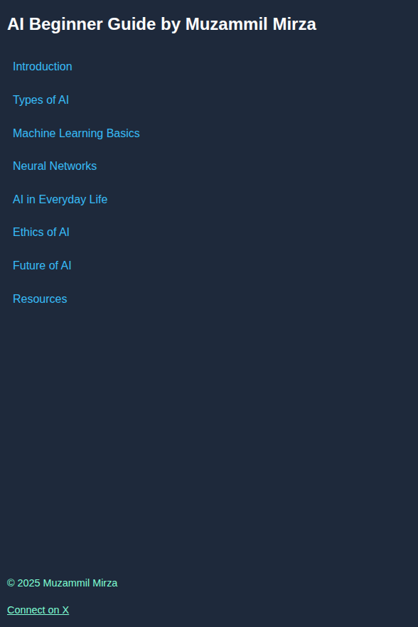

# 🤖 AI Beginner Guide by Muzammil Mirza

A beginner-friendly **AI Guide** built with **HTML** and **CSS**, featuring a responsive sidebar, structured sections, and simple code examples.  

---

## 📌 Table of Contents

- [📖 Introduction](#-introduction)  
- [🚀 Features](#-features)  
- [📸 Preview](#-preview)  
- [🌐 Live Demo](#-live-demo)  
- [📬 Author](#-author)  
- [📜 License](#-license)  

---

## 📖 Introduction

This guide introduces the fundamentals of **Artificial Intelligence (AI)**, covering its types, machine learning basics, neural networks, ethics, and real-world applications.  
It’s designed for beginners with clean explanations and sample code snippets.

---

## 🚀 Features

- 📑 Responsive **sidebar navigation**  
- 🧩 Beginner-friendly layout with **examples & code snippets**  
- 📱 Works smoothly on **desktop and mobile devices**  
- 🎨 Clean, modern, and minimal design  

---

## 📸 Preview

---

## 🌐 Live Demo

🔗 [View Live Demo](https://mozumil.github.io/technical-documentation-page/)

---

## 📬 Author

👨‍💻 **Muzammil Mirza**  
📌 Connect on X: [@hiMuzammil](https://x.com/hiMuzammil)  

© 2025 Muzammil Mirza  

---

## 📜 License

This project is licensed under the **Apache License 2.0**.  
See the full license here: [Apache License, Version 2.0](http://www.apache.org/licenses/)  

---
